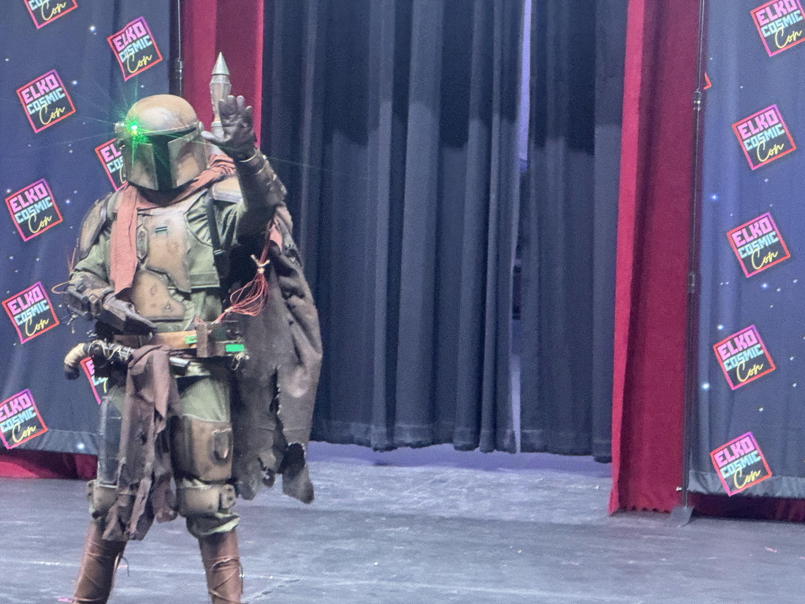
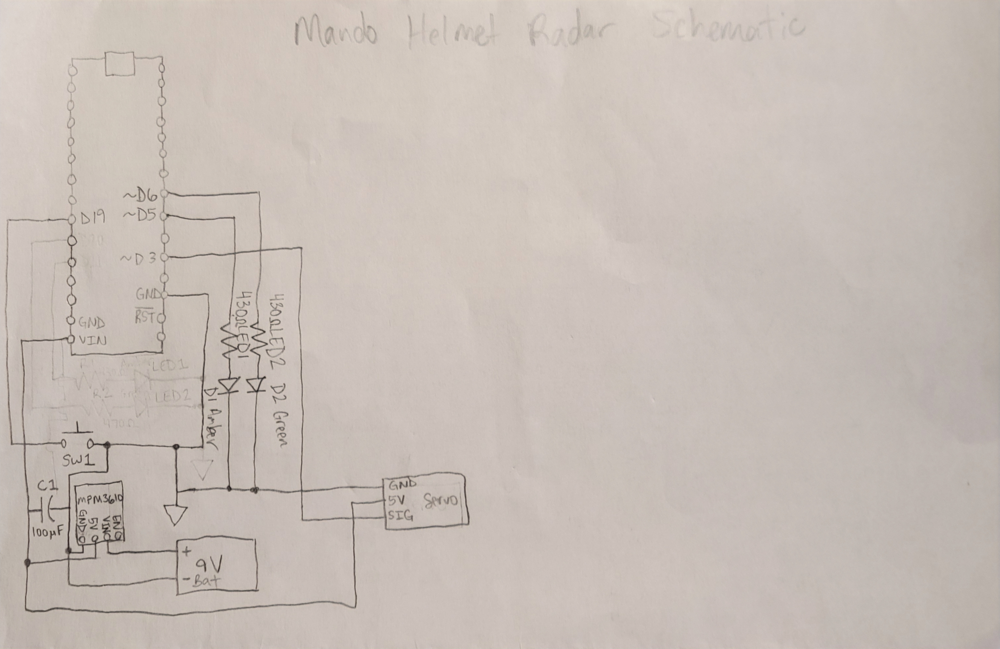
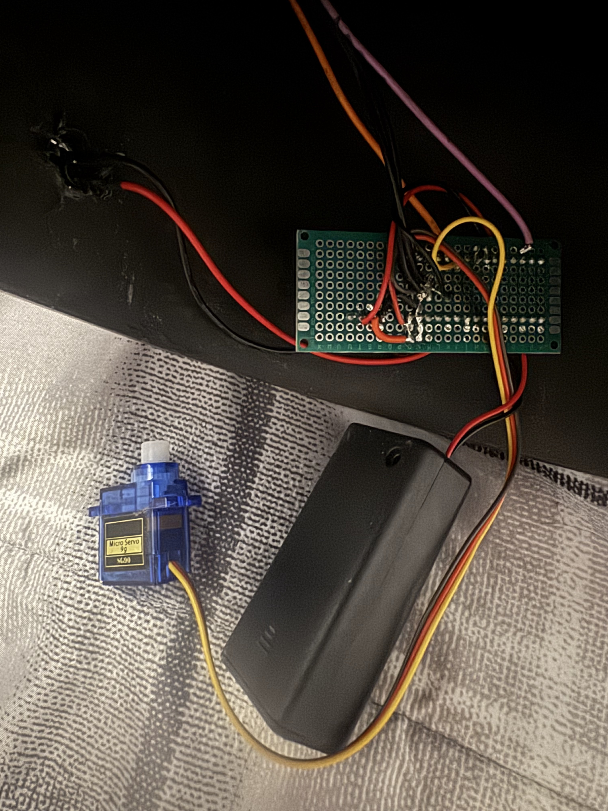
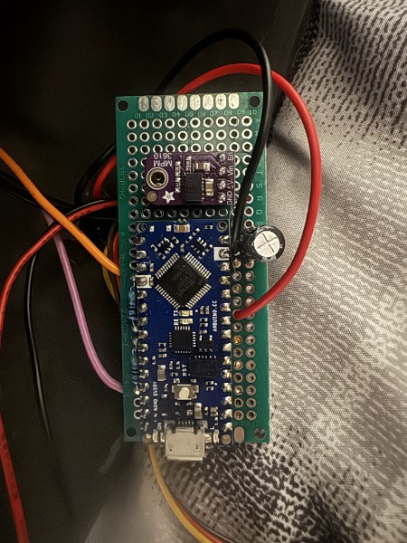
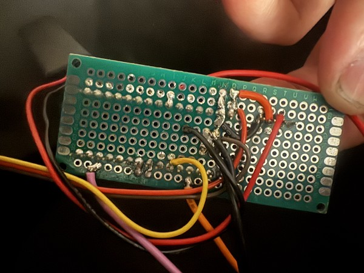
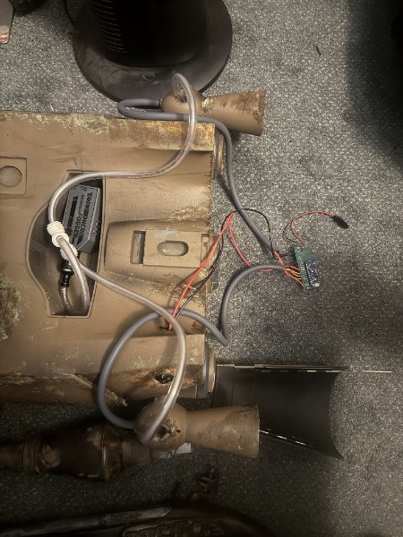
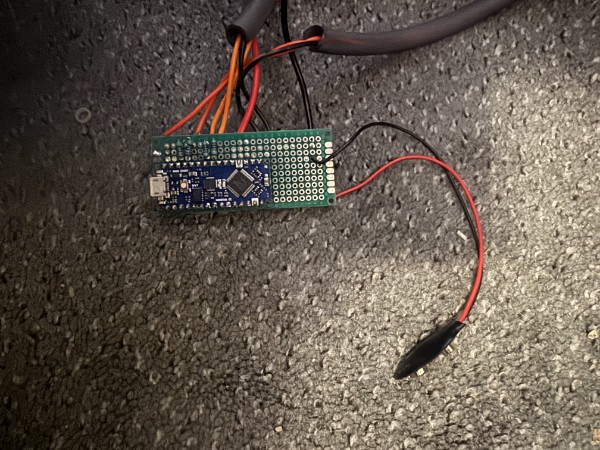
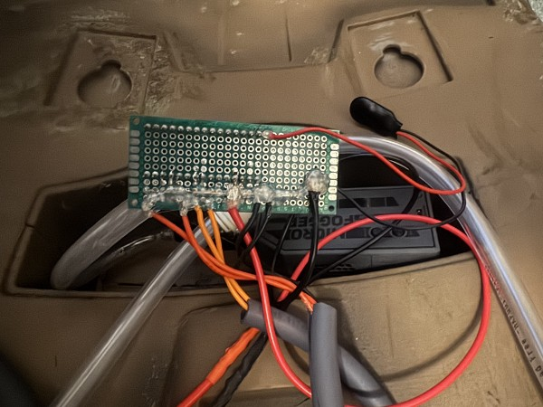
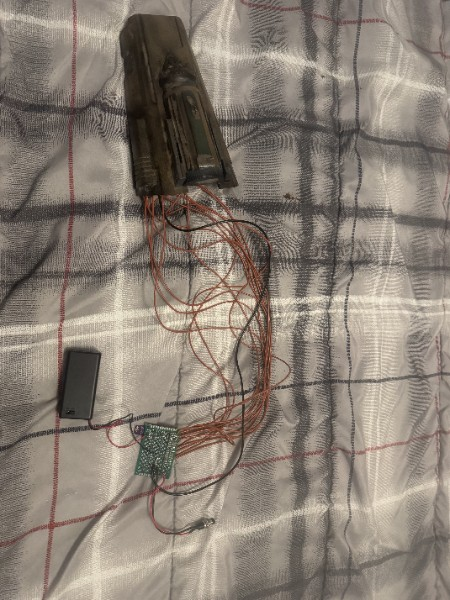
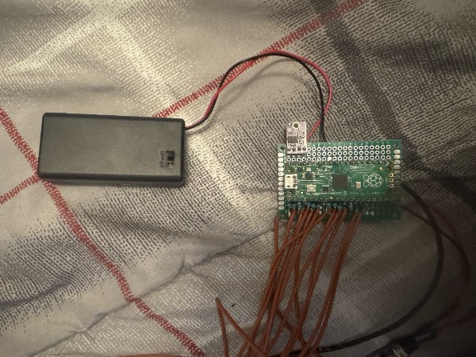

# Mandotronics
This project contains schematics and firmware for electronic modules for a Mandalorian cosplay suit. The three modules are:
- Helmet Radar
- Jetpack
- Whistling Birds

## Helmet Radar
Uses an Arduino Nano Every microcontroller, a 9g servo motor, 2 LEDs, and 1 press button to lower and raise the radar arm of a Mandalorian helmet, blinking 2 LEDs when the arm is lowered.

### Schematic

### Helmet Radar Module

- Helmet Radar circuit with Arduino Nano Every, 9V battery enclosure, and servo motor, with button and LED wires going into cutouts in helmet.

### Top of Helmet Radar Protoboard

### Bottom of Helmet Radar Protoboard

## Jetpack
Uses an Arduino Nano Every microcontroller and 4 LEDs to simulate a pulsing flame at the bottom of each jet of a Mandalorian jetpack. 2 LEDs are mapped to the 2 different jet boosters.

### Schematic

### Jetpack Module

- Back of jetpack with fog machine, Arduino Nano Every, LEDs, 9V battery connector, and rocker switch inside.

### Top of Jetpack Protoboard

### Bottom of Jetpack Protoboard

## Whistling Birds
This module displays a light sequence on LEDs to represent the whistling birds,
or wrist rockets Mandalorians use. It uses the Pi Pico microcontroller using
6 slices/12 channels of the PWM module for each of the 12 LEDs.

### Schematic

### Whistling Birds Module

- Whistling Birds gauntlet with LEDs inside and protoboard with Raspberry Pi Pico, 9V battery enclosure, and press button on the outside.

### Top of Whistling Birds Protoboard

