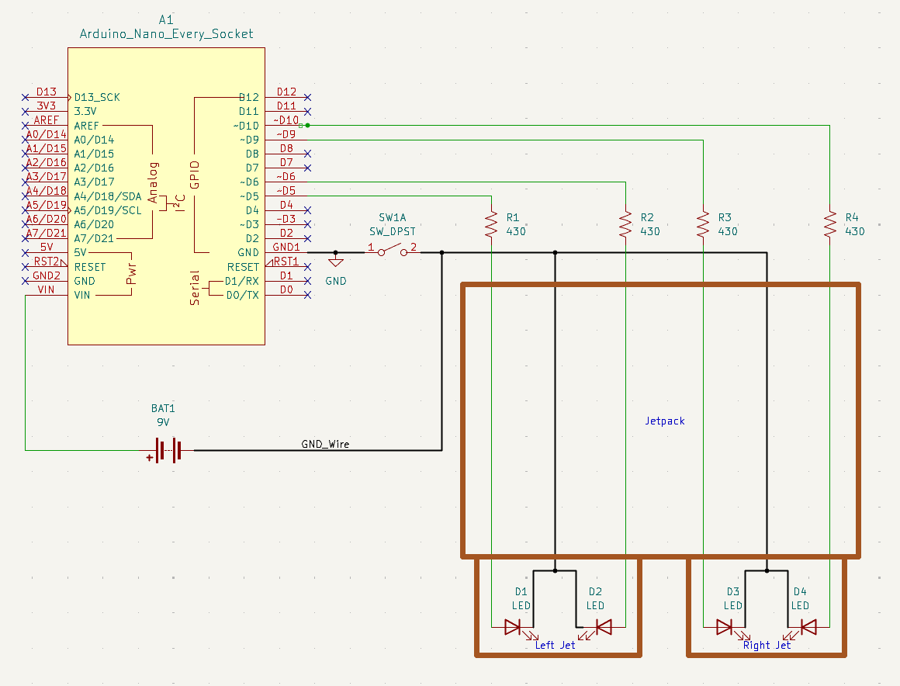
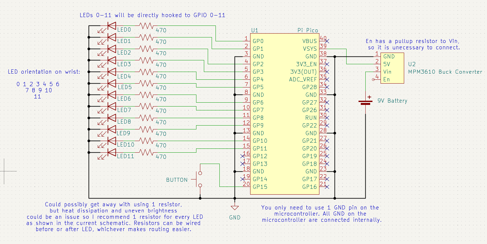

# Mandotronics
This project is to make hardware and software for Mandalorian cosplay electronics.
There are 3 modules: Helmet Radar, Jetpack, and Whistling Birds

## Helmet Radar
Uses an Arduino Nano Every microcontroller, a 9g servo motor, 2 LEDs, and 1 press button to lower and raise the radar arm of a Mandalorian helmet, blinking 2 LEDs when the arm is lowered.

## Jetpack
Uses an Arduino Nano Every microcontroller and 4 LEDs to simulate a pulsing flame at the bottom of each jet of a Mandalorian jetpack. 2 LEDs are mapped to the 2 different jet boosters.

## Whistling Birds
This module displays a light sequence on LEDs to represent the whistling birds,
or wrist rockets Mandalorians use. It uses the Pi Pico microcontroller using
6 slices/12 channels of the PWM module for each of the 12 LEDs. 

